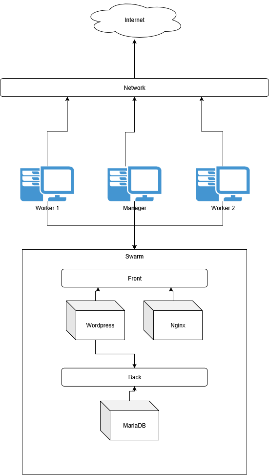

# DockerSwarm
## Mise en place du swarm
Sur le manager:
Pour créer le swarm, nous pouvons exécuter la commande suivante:
```bash
docker swarm init --advertise-addr [Ip du manager]
```
Sur les workers
Pour rejoindre le swarm crée par le manager, nous pouvons exécuter la commande suivante:
```bash
docker swarm join --token [Votre Token] [Ip du manager]:2377
```
Vous devriez voir : 
```
This node joined a swarm as a worker.
```
Pour verfifer que les workers sont bien connetctés, nous pouvons exécuter la commande suivante 
sur le manager pour afficher les noeuds du swarm:
```bash
docker node ls
```
## Déploiement du stack
Sur le manager:
Pour deployer le stack, nous pouvons exécuter la commande suivante:
Le flag -c est pour specifier ou est le fichier stack
Par conséquent, vous devrez peut-être modifier le chemin d'accès en fonction de l'endroit où vous décidez d'exécuter la commande
```bash
docker stack deploy -c stack.yml [Nom du stack]
```
## Installation de SwarmPit
Sur le manager:
Ceci lance un contenaire avec l'image officielle de swarmpit pour son installation
```
docker run -it --rm \
  --name swarmpit-installer \
  --volume /var/run/docker.sock:/var/run/docker.sock \
swarmpit/install:1.9
```
Nous avons utilisé la configuration suivante:
- Nom de la stack: swarmpit
- Port de swarmpit: 888
- Volume de la DB: local
- Nom d'utilisateur admin: admin
- Mot de passe admin: rootroot
Si cela a fonctionné vous devriez voir:
```
Swarmpit is running on port :888
```
# En cas d'erreures
En cas de problemes de déploiement, vous pouvez utiliser cette commande pour suprrimer le stack
```
docker stack rm [Nom du stack]
```
En cas de problemes de volumes persistants, vous pouvez utiliser cette commande pour supprimer les volumes
```
docker volume rm [Nom du volume]
```

## Schema

Voici le schema reseau du Swarm




